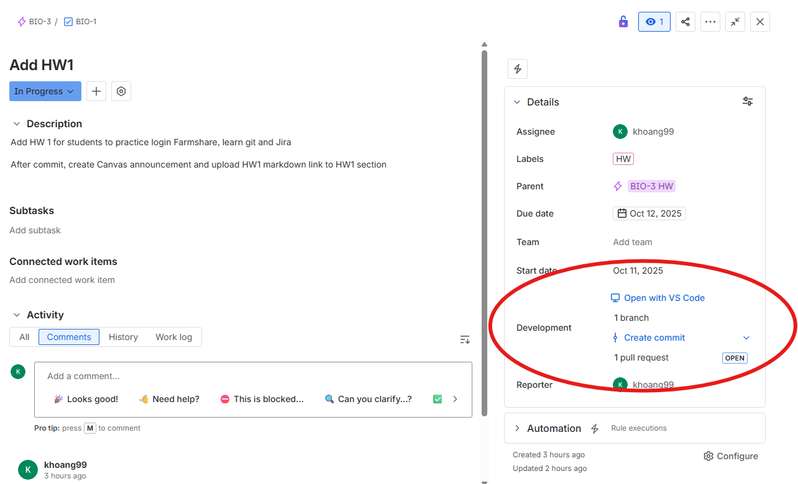

# HW1: Farmshare Login + Learning Git + Jira

## Goals
- Understand what version control and Git are.
- Practice core Git workflows: clone, branch, commit, push, and pull request.
- Learn how to use Jira for task management


## Farmshare Setup

We will be working on [**Farmshare**](https://docs.farmshare.stanford.edu/) throughout this course. Follow these steps for logging in and initial setup.

### 1) Log into Farmshare
```bash
ssh SUNetID@login.farmshare.stanford.edu
```

### 2) Generate an SSH key on Farmshare
> The key should be created on Farmshare, as GitHub checks the identity of the connecting system

```bash
# Create a modern ed25519 key (recommended)
ssh-keygen -t ed25519 -C "SUNetID@stanford.edu"
# I recommend save key path to ~/.ssh/id_ed25519_farmshare_[Your_Github_Username]
# Skip passphrase
```

### 3) Start the SSH agent and add your key
```bash
# Start the agent (if not already running)
eval "$(ssh-agent -s)"
# Add your private key to the agent
ssh-add ~/.ssh/id_ed25519_farmshare_[Your_Github_Username]
```

### 4) Add your public key to GitHub
1. Show your **public** key and copy it:
   ```bash
   cat ~/.ssh/id_ed25519_farmshare_[Your_Github_Username].pub
   ```
2. In a web browser, go to **GitHub → Settings → SSH and GPG keys → New SSH key**.  
3. Title it (e.g., “Farmshare”) and paste the copied key. Save.

> ⚠️ Never share your **private** key (`~/.ssh/id_ed25519_farmshare_[Your_Github_Username]`). Only the **.pub** file is safe to share.

### 5) Test the GitHub SSH connection
```bash
ssh -T git@github.com
```
You should see a success message like: *“Hi your-username! You've successfully authenticated, but GitHub does not provide shell access.”*

### 6) Work in your `$SCRATCH` space
```bash
# Ensure it exists, then switch to it
echo $SCRATCH
# You should see /farmshare/user_data/[SUNetID]
cd $SCRATCH
# If SCRATCH has not been set 
export SCRATCH=/farmshare/user_data/[SUNetID]
cd $SCRATCH
```

---

## HW Part A - Watch Intro Videos (~15 mins)
- [What is Version Control?](https://git-scm.com/video/what-is-version-control.html)
- [What is Git?](https://git-scm.com/video/what-is-git.html)

---

## HW Part B - Interactive Tutorial
Complete the exercises at **https://learngitbranching.js.org/**

- **Main** tab → **Introduction Sequence** (complete **all 4** modules)
- **Remote** tab → **Push & Pull — Git Remotes!** (complete **all 8** modules)

> Tip: Take screenshots of the “level complete” screens—you’ll paste them below.

---

## HW Part C - Practice

1. **Create a [GitHub](https://github.com/) account** (if you don’t have one).
2. **Fork** the course [repository](https://github.com/khoa-yelo/BIOS270-AU25) to your GitHub account.

3. **Clone** your fork (not the original course repo) to your local machine via ssh:
   ```bash
   cd $SCRATCH
   mkdir repos
   cd repos
   git clone git@github.com:[your-user-name]/BIOS270-AU25.git
   cd BIOS270-AU25
   ```
4. **Create a new branch** for your changes and **checkout** that branch:

5. **Edit the write-up**  
   - Open `Writeup0.md`
   - Modify **Name** and **SUNetID** to your name and SUNetID

6. **Add tutorial screenshots**  
   - Append them at the end of this document (see section below).

7. **Commit your changes**  
   Since there are two conceptual tasks (editing `Writeup0.md` and adding screenshots), consider having **two separate commits**:

8. **Push your branch to your forked repo**:

9. **Open a Pull Request (PR)**  
   - Base: **your fork’s** `main`  
   - Compare: `your-new-branch`  
   - Add a title and short description, then **Create PR**.
   - Merge PR
    > ⚠️ Make sure you are making a PR **into your fork main**, not the upstream (original) repo. GitHub may default to upstream, change it if needed.

---

## HW Part D - Jira (Optional)

### Why use Jira?
As a project grows and more people get involved, it becomes harder to keep track of who’s doing what and how different pieces fit together.  
**Jira** helps teams plan, track, and organize their work. It connects with **GitHub** so that each commit, branch, or pull request can be linked to a specific task. This makes it easier to see **who is doing what**, **what’s done**, and **what’s left**.

---

### Steps

1. **Log into Jira**  
   - Create a [Jira](https://www.atlassian.com/software/jira) account with your email (same as the one you use for logging into Github)

2. **Create a new project**
   - Create a new `project` (or `space`- updated name) with Kanban template and name it `BIOS270`
   

   
3. **Connect Jira with GitHub**  
   - In Jira, click **Code** and select **Connect Github**.  
   - Follow the prompts to connect your GitHub account.  
   - This allows Jira to automatically link commits and pull requests to issues.

4. **Create a Task**  
   - Create a **Task** called “HW1” and fill out the content (e.g. Title, Description, Due Date, Assignee, etc...)
   - Note the task ID (e.g., `BIOS-1`).
   
   


5. **Create a Branch for Your Task**
   - Name the branch with task ID inside (e.g. BIOS-1-hw1)

   ```bash
   git checkout -b BIOS-1-hw1
   ```
   - Create some changes in this `HW1.md`, for example, change this SUNetID to yours `khoang99`
   - Commit with task ID in message then push the changes
   
   ```
   git commit -m "BIO-1: update hw1 in Jira section"
   ```
   - Create a PR to main, title the PR with task ID (e.g. BIOS-1: Update HW1) then merge.

6. **Check back on Jira Task**
   - Now, check your task on Jira, do you notice that the PR and commit has been linked to your task description? This is neat, isn't it!
   


## Screenshots of Git Tutorials

> Add your completion screenshots here (Introduction Sequence and Push & Pull — Git Remotes!).

- Introduction Sequence — 4/4 complete:  
  _Paste image(s) here_

- Push & Pull — Git Remotes! — 8/8 complete:  
  _Paste image(s) here_

---

## HW Submission

Submit the **link to this Markdown file** to **Canvas**.

---

---


### Helpful Git Commands

```bash
# Configure identity (once per machine/repo)
git config user.name "Your Name"
git config user.email "your-email@example.com"

# See remotes (origin = your fork; upstream = original repo if added)
git remote -v

# Add upstream (optional but recommended)
git remote add upstream https://github.com/khoa-yelo/BIOS270-AU25.git
```