# Write-up 0: 


**Name:** Eliel Akinbami  
**Student ID:** elielkin  
**Date:** 11/11/2025  

---

## Overview  
> This document is a compilation of my submission for Homework 1, including images for using git. 

---

## Content

### HW Part A
- Git provides a ***history*** of content changes
- ```bash
    git log --graph --decorate --abbrev-commit --all --pretty=oneline
    ```

### HW Part B
Below are the images from HW1.
#### Introduction sequence
***Introduction 1***
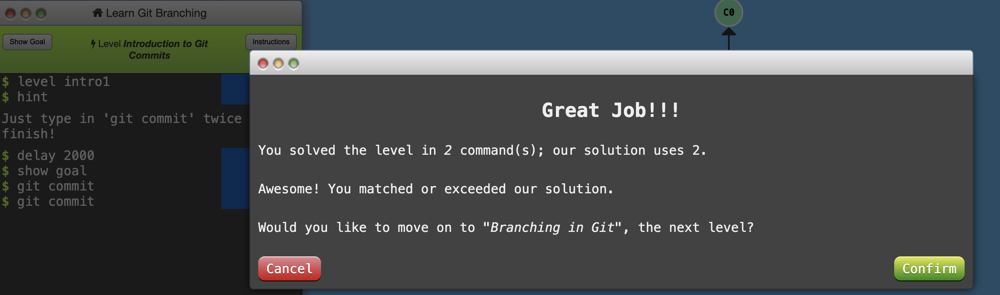  

***Branching in Git***
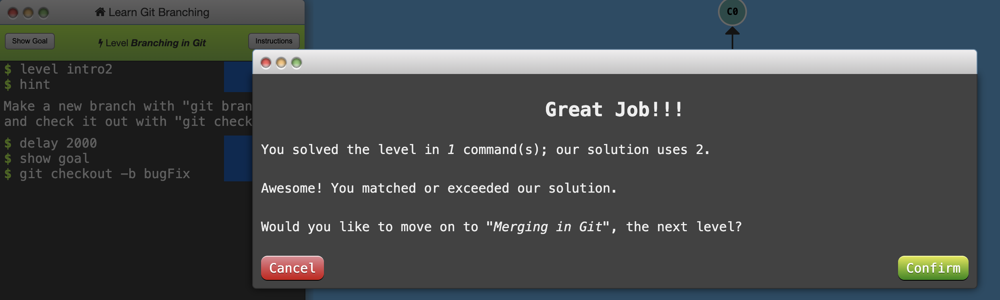 

***Merging in Git***
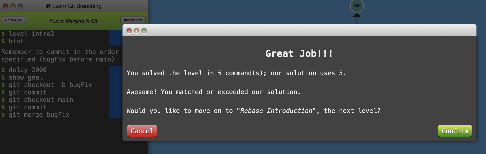   

***Rebase Introduction***
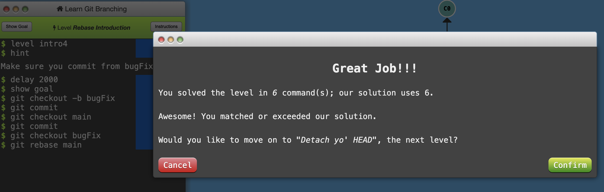  

#### Push & Pull - Git Remotes!
***Remote 1***
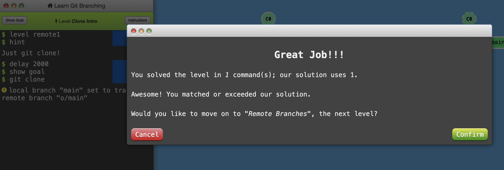  
***Remote branches***
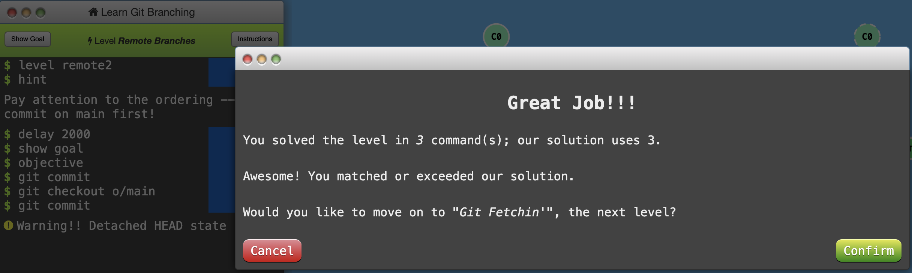  
***Git Fetchin***
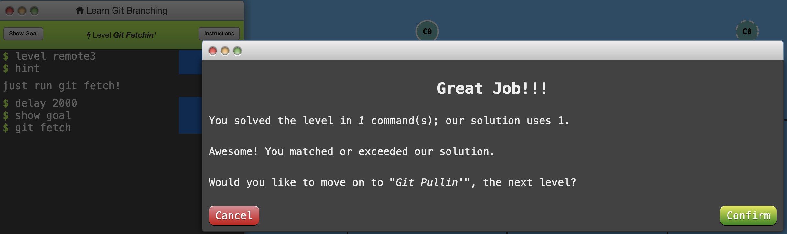  
***Git Pullin***
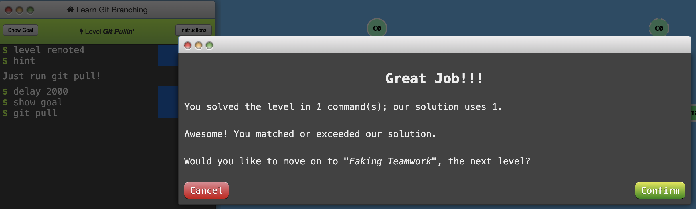  
***Faking Teamwork***
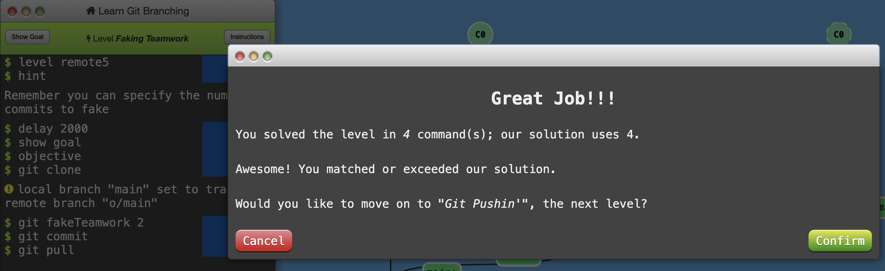  
***Git Pushin***
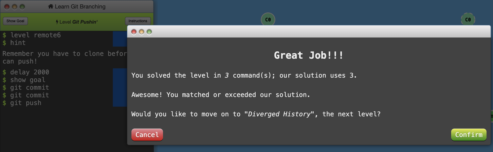  
***Diverged History***
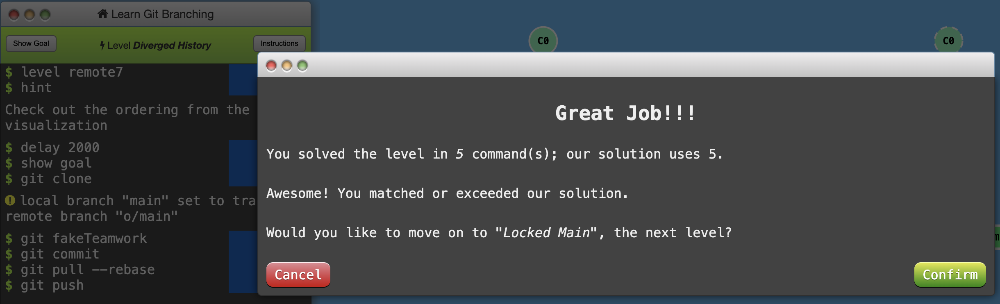  
***Locked Main***
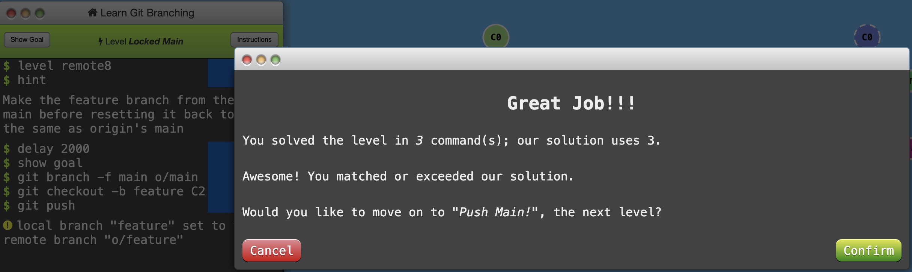  


### HW Part D