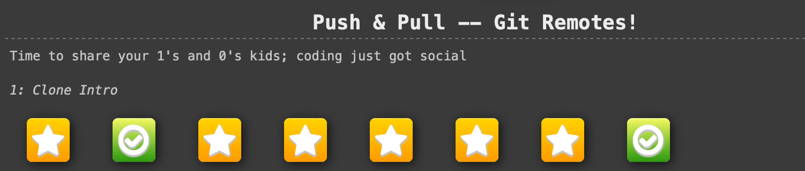
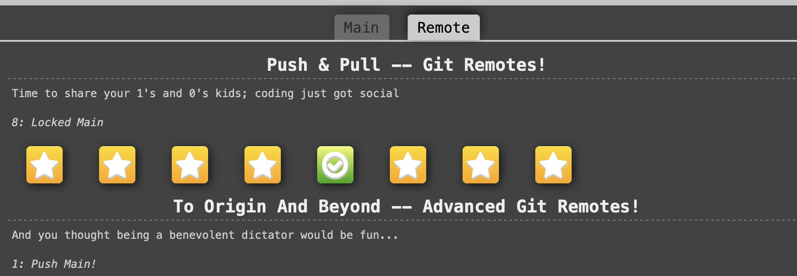

# Write-up 0: template

**Name:** Xinyi Chen  
**Student ID:** chenxy19
**Date:** 11/11/2025  

---

## Overview

---

## Content

1. HWA: Git provides a record of content changes
   
git log

2. 
This is the main part of your write-up.  
You can include explanations, examples, and notes

