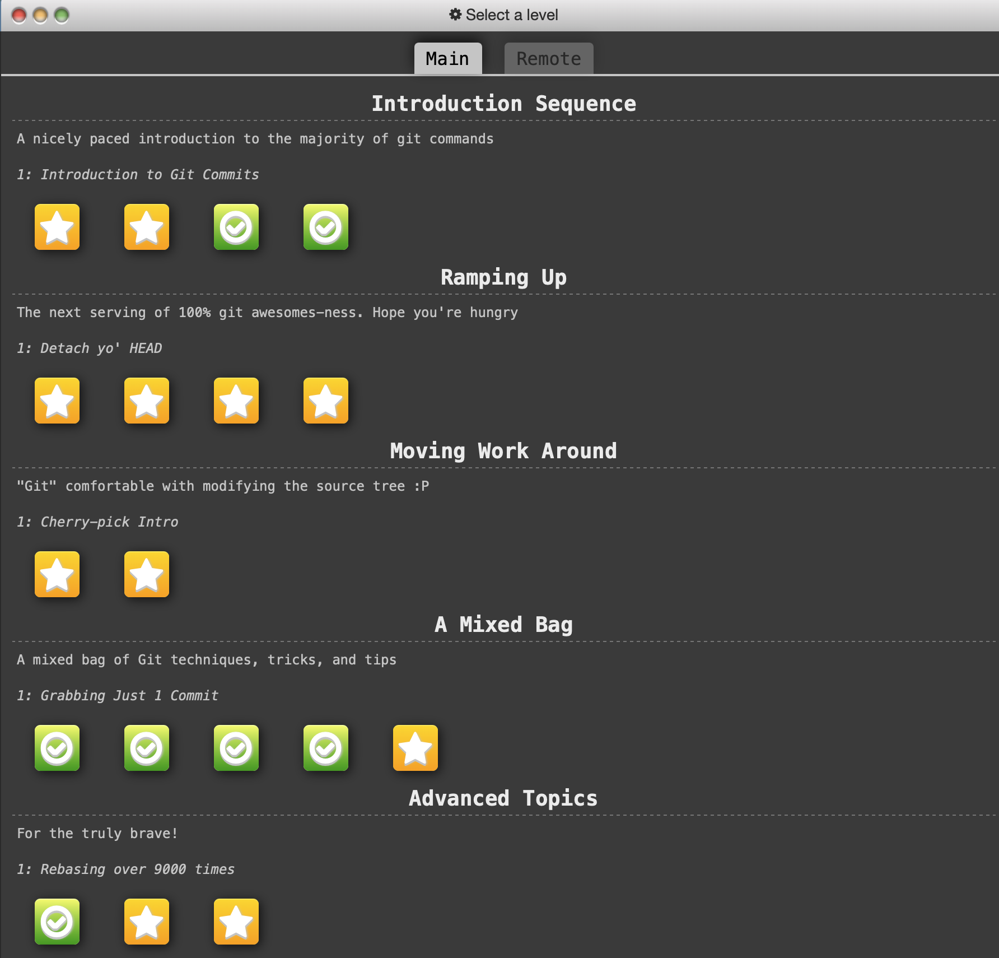
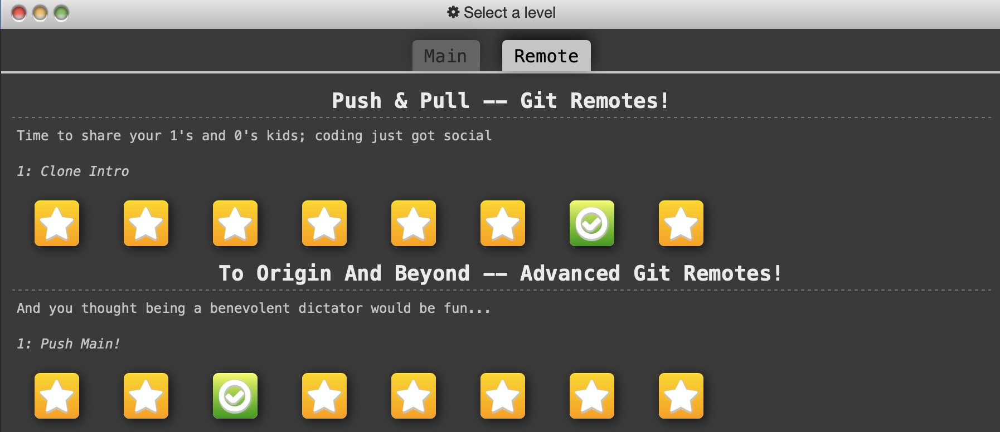

# Write-up 0: template

**Name:** Friederike Held  
**Student ID:** fheld 
**Date:** 11/11/2025  

---
## HW Submission
**HW Part A**
- Question1: Git provides a ... of content changes
- Answer: Git provides a history of content changes.

- Question: Which git command shows you the historical graphical representation of branching and merging events?
- Answer: git log --graph

**HW Part B**
- Introduction Sequence - 4/4 complete:
 

- Push&Pull - Git Remote! - 8/8 complete:
 

**HW Part C**
- The URL of this Markdown file is: https://github.com/held-fh/BIOS270-AU25/blob/main/Writeups/writeup0/writeup0.md
---
## Overview

This section introduces the purpose of the write-up.  
For example:  
> This document is a practice exercise in writing and formatting Markdown files clearly and professionally.

---

## Content

This is the main part of your write-up.  
You can include explanations, examples, and notes 

You can use some text formating, lists, and tables to imporve the write-up readability
#### **Text Formatting**

You can make text **bold**, *italic*, or even ***bold and italic*** for emphasis.

#### **Lists**

**Unordered list:**
- Apple  
- Banana  
- Cherry  

**Ordered list:**
1. First step  
2. Second step  
3. Third step  

#### **Table Example**

| Tool | Description         | Example Command        |
|------|---------------------|------------------------|
| `ls` | Lists files         | `ls -la`               |
| `grep` | Searches text     | `grep "pattern" file.txt` |
| `wc` | Counts words/lines  | `wc -l filename.txt`   |

Code snippets and images are highly recommended to document your work.

#### **Code Examples**

**Inline code example:** Use the `print()` function to display text.  

**Code block example:**

```bash
# Example command line code
echo "Hello, Markdown!"
```

```python
# Example Python code
for i in range(3):
    print("Iteration:", i)
```

For longer script, you can say something like, `script1.py` contains functions for reading fasta file. Ideally, all codes you run should be saved in corresponding files. 


#### **Image Example**


#### **Link Example**

Learn more about Markdown syntax here:  
[Markdown Guide](https://www.markdownguide.org/basic-syntax/)

---

## Acknowledgement
Collaborator: Brady Hislop
