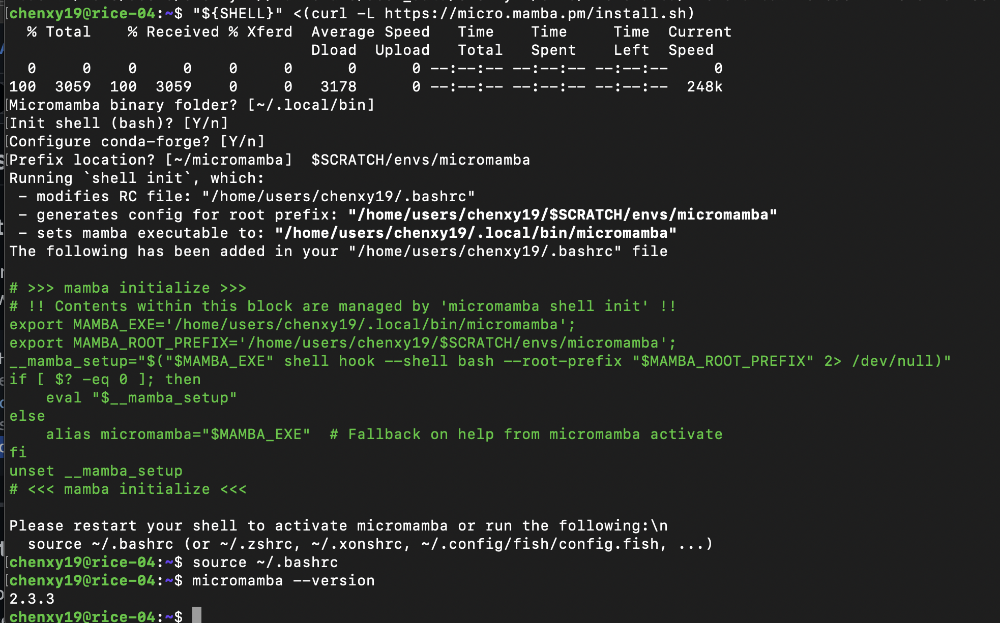
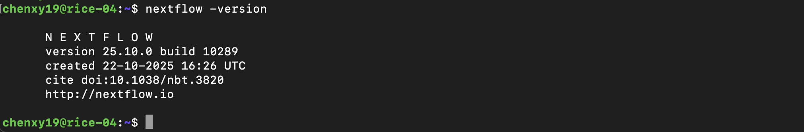
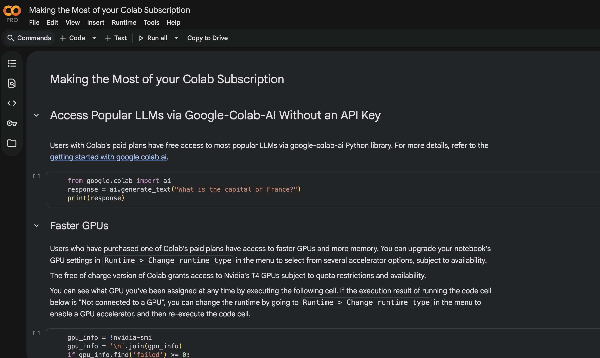

# Write-up 0: template

**Name:** Xinyi Chen  
**Student ID:** chenxy19
**Date:** 11/11/2025  

---

## Overview

---

## Content

1. 3 tasks are submitted in parallel

2. The if statement ask if the remainder when line number is divided by 3 equal the task ID (0-2). If so, it will print the line number as well as the value on such line.

3. The output is:

Output0: 

0: 12
3: 8

Output1:

1: 7
4: 27

Output2:

2: 91
5: 30

Screenshots: 

