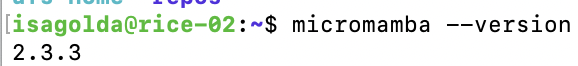

 
--
 ![Nextflow installation](nextflow.png
--

**Answer the following questions in your write-up:**
--
How many slurm job will be submitted?
3 jobs - 0, 1 and 2

What is the purpose of the if statement?
If is a way to read the words every 3 lines for the 3 different tasks and make it more efficient by having 3 tasks insead of 1.

What is the expected output in each *.out file?
3 different files, each having its corresponding 3 different lines.
