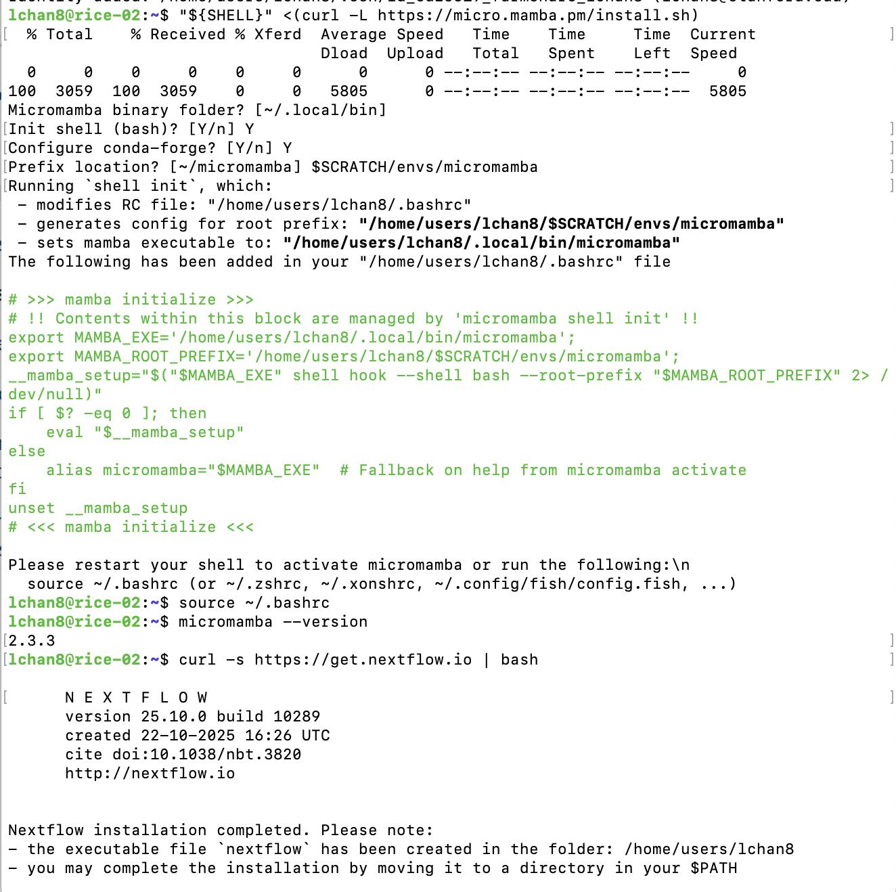
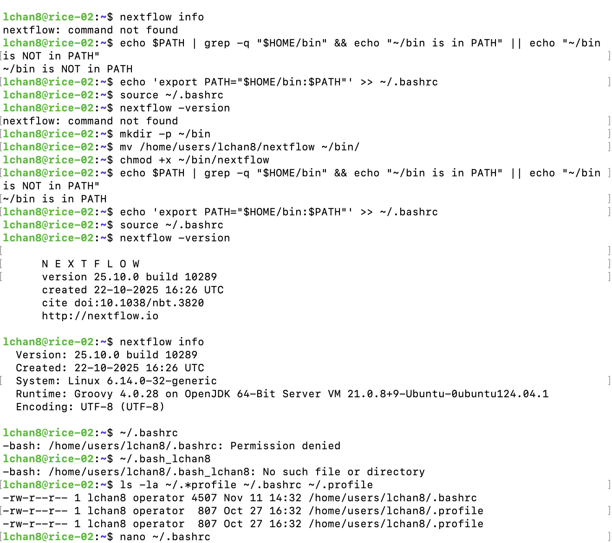
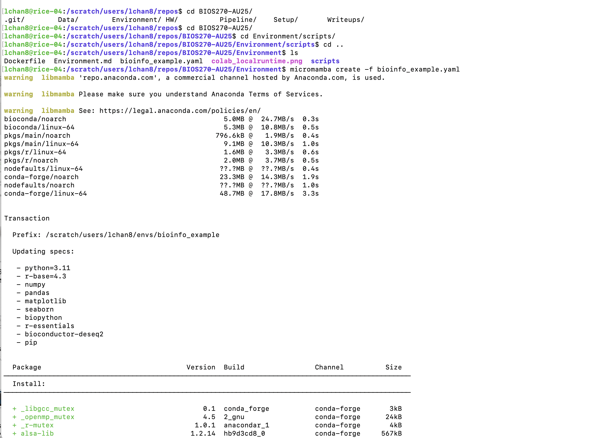
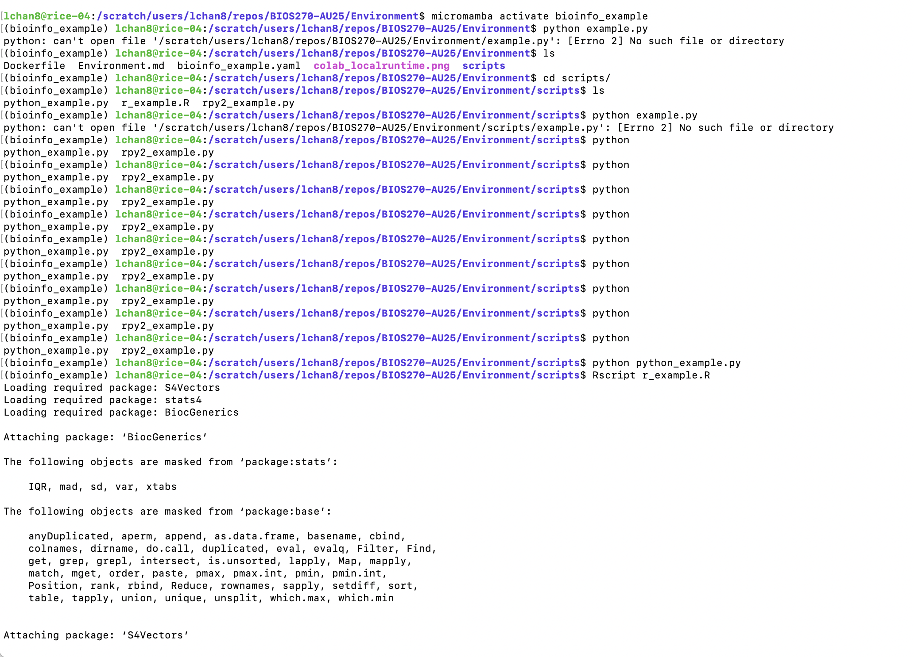
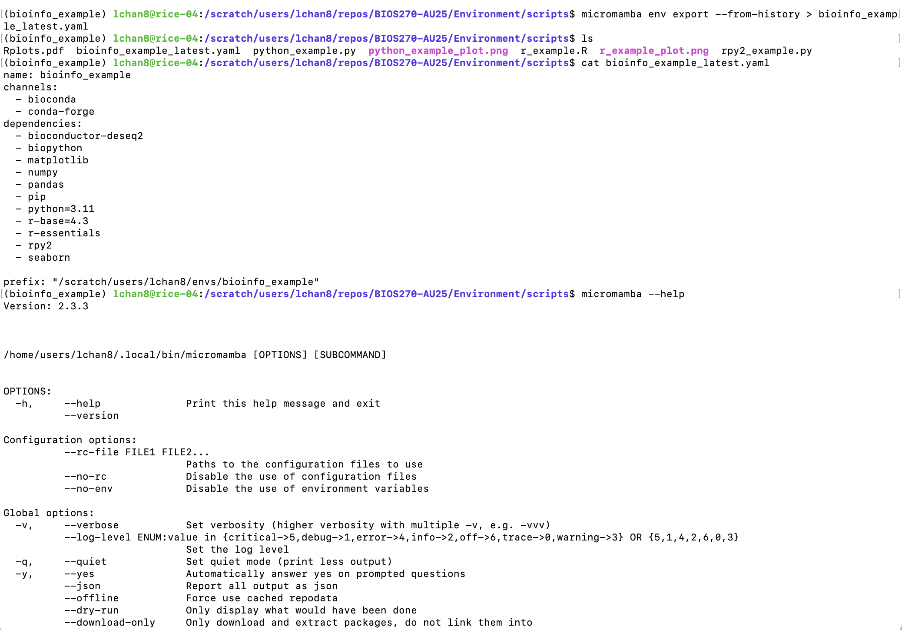

# Write-up 1

**Name:** Leslie Chan  
**Student ID:** lchan8  
**Date:** 11/13/2025  

---
## Setup.md

**Screenshots**



1. 3 jobs will be submitted.
2. The if statement distributes the jobs across the array tasks.
3. 

Task 0 output file is 
```bash
0: 12
3: 8
```

Task 1 output file is 
```bash
1: 7
4: 27
```

Task 2 output file is 
```bash
2: 91
5: 30
```

## Environment.md
**Micromamba**

**Screenshots**





```bash
# What micromamba command can you use to list all created environemnts?
micromamba env list

# What micromamba command can you use to list all packages installed in a specific environment?
micromamba list -n

# What micromamba command can you use to remove a package?
micromamba remove

# What micromamba command can you use to install a package from a specific channel?
micromamba install -c

# What micromamba command can you use to remove an environment?
micromamba env remove

# What are all the r-base and Bioconductor packages that were installed in the bioinfo_example environment? (Hint: You may want to use one of the commands from your answers to the above questions, and combine it with the grep command.)
micromamba list -n bioinfo_example | grep -E "(^r-|bioconductor-)"
```

  bioconductor-apeglm                1.24.0        r43hf17093f_1         bioconda   
  bioconductor-biobase               2.62.0        r43ha9d7317_3         bioconda   
  bioconductor-biocgenerics          0.48.1        r43hdfd78af_2         bioconda   
  bioconductor-biocparallel          1.36.0        r43hf17093f_2         bioconda   
  bioconductor-data-packages         20250625      hdfd78af_0            bioconda   
  bioconductor-delayedarray          0.28.0        r43ha9d7317_2         bioconda   
  bioconductor-deseq2                1.42.0        r43hf17093f_2         bioconda   
  bioconductor-genomeinfodb          1.38.1        r43hdfd78af_1         bioconda   
  bioconductor-genomeinfodbdata      1.2.11        r43hdfd78af_1         bioconda   
  bioconductor-genomicranges         1.54.1        r43ha9d7317_2         bioconda   
  bioconductor-iranges               2.36.0        r43ha9d7317_2         bioconda   
  bioconductor-matrixgenerics        1.14.0        r43hdfd78af_3         bioconda   
  bioconductor-s4arrays              1.2.0         r43ha9d7317_2         bioconda   
  bioconductor-s4vectors             0.40.2        r43ha9d7317_2         bioconda   
  bioconductor-sparsearray           1.2.2         r43ha9d7317_2         bioconda   
  bioconductor-summarizedexperiment  1.32.0        r43hdfd78af_0         bioconda   
  bioconductor-xvector               0.42.0        r43ha9d7317_2         bioconda   
  bioconductor-zlibbioc              1.48.0        r43ha9d7317_2         bioconda

## Overview

This section introduces the purpose of the write-up.  
For example:  
> This document is a practice exercise in writing and formatting Markdown files clearly and professionally.

---

## Content

This is the main part of your write-up.  
You can include explanations, examples, and notes 

You can use some text formating, lists, and tables to imporve the write-up readability
#### **Text Formatting**

You can make text **bold**, *italic*, or even ***bold and italic*** for emphasis.

#### **Lists**

**Unordered list:**
- Apple  
- Banana  
- Cherry  

**Ordered list:**
1. First step  
2. Second step  
3. Third step  

#### **Table Example**

| Tool | Description         | Example Command        |
|------|---------------------|------------------------|
| `ls` | Lists files         | `ls -la`               |
| `grep` | Searches text     | `grep "pattern" file.txt` |
| `wc` | Counts words/lines  | `wc -l filename.txt`   |

Code snippets and images are highly recommended to document your work.

#### **Code Examples**

**Inline code example:** Use the `print()` function to display text.  

**Code block example:**

```bash
# Example command line code
echo "Hello, Markdown!"
```

```python
# Example Python code
for i in range(3):
    print("Iteration:", i)
```

For longer script, you can say something like, `script1.py` contains functions for reading fasta file. Ideally, all codes you run should be saved in corresponding files. 


#### **Image Example**


#### **Link Example**

Learn more about Markdown syntax here:  
[Markdown Guide](https://www.markdownguide.org/basic-syntax/)

---


## Acknowledgement
Collaborator: Brady Hislop
