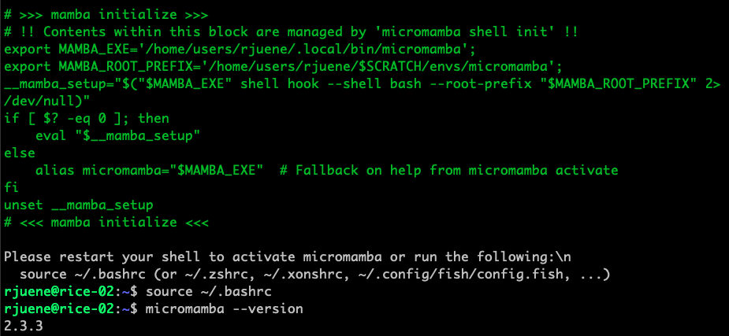
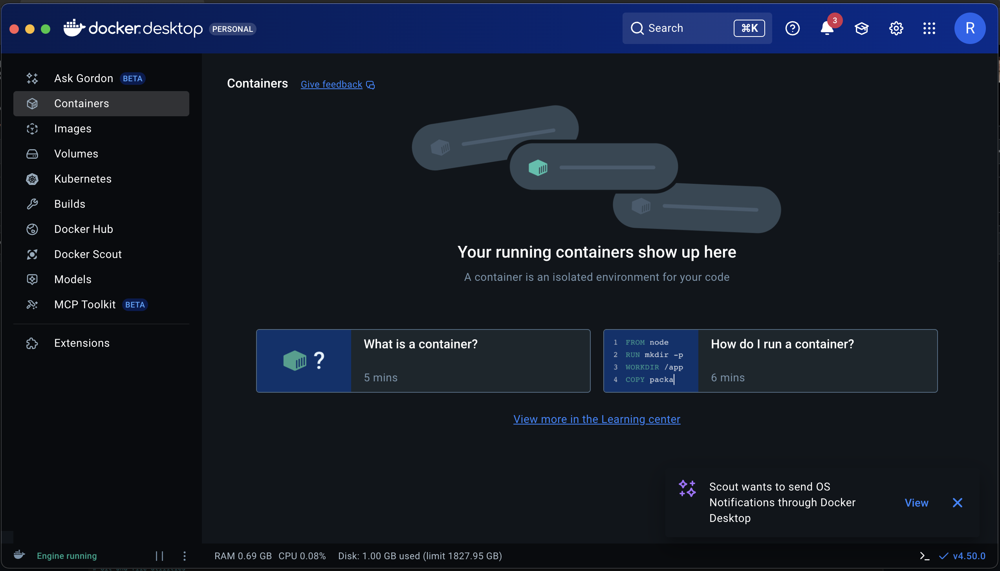
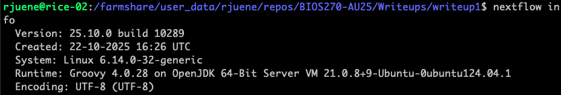

# Write-up 0: template

**Name:** Riley Juenemann       
**Student ID:** rjuene    
**Date:** 11/11/2025    

---

## Bash profile setup

```
# ~/.bashrc: executed by bash(1) for non-login shells.
# see /usr/share/doc/bash/examples/startup-files (in the package bash-doc)
# for examples

# If not running interactively, don't do anything
case $- in
    *i*) ;;
      *) return;;
esac

# don't put duplicate lines or lines starting with space in the history.
# See bash(1) for more options
HISTCONTROL=ignoreboth

# append to the history file, don't overwrite it
shopt -s histappend

# for setting history length see HISTSIZE and HISTFILESIZE in bash(1)
HISTSIZE=1000
HISTFILESIZE=2000

# check the window size after each command and, if necessary,
# update the values of LINES and COLUMNS.
shopt -s checkwinsize

# If set, the pattern "**" used in a pathname expansion context will
# match all files and zero or more directories and subdirectories.
#shopt -s globstar

# make less more friendly for non-text input files, see lesspipe(1)
[ -x /usr/bin/lesspipe ] && eval "$(SHELL=/bin/sh lesspipe)"

# set variable identifying the chroot you work in (used in the prompt below)
if [ -z "${debian_chroot:-}" ] && [ -r /etc/debian_chroot ]; then
    debian_chroot=$(cat /etc/debian_chroot)
fi

# set a fancy prompt (non-color, unless we know we "want" color)
case "$TERM" in
    xterm-color|*-256color) color_prompt=yes;;
esac

# uncomment for a colored prompt, if the terminal has the capability; turned
# off by default to not distract the user: the focus in a terminal window
# should be on the output of commands, not on the prompt
#force_color_prompt=yes

if [ -n "$force_color_prompt" ]; then
    if [ -x /usr/bin/tput ] && tput setaf 1 >&/dev/null; then
	# We have color support; assume it's compliant with Ecma-48
	# (ISO/IEC-6429). (Lack of such support is extremely rare, and such
	# a case would tend to support setf rather than setaf.)
	color_prompt=yes
    else
	color_prompt=
    fi
fi

if [ "$color_prompt" = yes ]; then
    PS1='${debian_chroot:+($debian_chroot)}\[\033[01;32m\]\u@\h\[\033[00m\]:\[\033[01;34m\]\w\[\033[00m\]\$ '
else
    PS1='${debian_chroot:+($debian_chroot)}\u@\h:\w\$ '
fi
unset color_prompt force_color_prompt

# If this is an xterm set the title to user@host:dir
case "$TERM" in
xterm*|rxvt*)
    PS1="\[\e]0;${debian_chroot:+($debian_chroot)}\u@\h: \w\a\]$PS1"
    ;;
*)
    ;;
esac

# enable color support of ls and also add handy aliases
if [ -x /usr/bin/dircolors ]; then
    test -r ~/.dircolors && eval "$(dircolors -b ~/.dircolors)" || eval "$(dircolors -b)"
    alias ls='ls --color=auto'
    #alias dir='dir --color=auto'
    #alias vdir='vdir --color=auto'

    alias grep='grep --color=auto'
    alias fgrep='fgrep --color=auto'
    alias egrep='egrep --color=auto'
fi

# colored GCC warnings and errors
#export GCC_COLORS='error=01;31:warning=01;35:note=01;36:caret=01;32:locus=01:quote=01'

# some more ls aliases
alias ll='ls -alF'
alias la='ls -A'
alias l='ls -CF'

# Add an "alert" alias for long running commands.  Use like so:
#   sleep 10; alert
alias alert='notify-send --urgency=low -i "$([ $? = 0 ] && echo terminal || echo error)" "$(history|tail -n1|sed -e '\''s/^\s*[0-9]\+\s*//;s/[;&|]\s*alert$//'\'')"'

# Alias definitions.
# You may want to put all your additions into a separate file like
# ~/.bash_aliases, instead of adding them here directly.
# See /usr/share/doc/bash-doc/examples in the bash-doc package.

if [ -f ~/.bash_aliases ]; then
    . ~/.bash_aliases
fi

# enable programmable completion features (you don't need to enable
# this, if it's already enabled in /etc/bash.bashrc and /etc/profile
# sources /etc/bash.bashrc).
if ! shopt -oq posix; then
  if [ -f /usr/share/bash-completion/bash_completion ]; then
    . /usr/share/bash-completion/bash_completion
  elif [ -f /etc/bash_completion ]; then
    . /etc/bash_completion
  fi
fi


export SCRATCH=/farmshare/user_data/rjuene

# >>> mamba initialize >>>
# !! Contents within this block are managed by 'micromamba shell init' !!
export MAMBA_EXE='/home/users/rjuene/.local/bin/micromamba';
export MAMBA_ROOT_PREFIX='/home/users/rjuene/$SCRATCH/envs/micromamba';
__mamba_setup="$("$MAMBA_EXE" shell hook --shell bash --root-prefix "$MAMBA_ROOT_PREFIX" 2> /dev/null)"
if [ $? -eq 0 ]; then
    eval "$__mamba_setup"
else
    alias micromamba="$MAMBA_EXE"  # Fallback on help from micromamba activate
fi
unset __mamba_setup
# <<< mamba initialize <<<


# Example custom bash profile

# -----------------------------
# Functions
# -----------------------------
# Example: print numbers from 1 to N (default = 5)
count() {
  local limit=${1:-5}
  for ((i=1; i<=limit; i++)); do
    echo "Count is: $i"
    sleep 1
  done
}

# -----------------------------
# Environment variables
# -----------------------------
export CLASS="/farmshare/home/classes/bios/270"

# -----------------------------
# Basic shortcuts
# -----------------------------
alias reload="source ~/.bashrc"
alias l='ls -ltrh'
alias ..="cd .."

# -----------------------------
# Quick navigation
# -----------------------------
alias cdc="cd $CLASS"

# -----------------------------
# Git and file utilities
# -----------------------------
alias gs="git status"
alias usage='du -h -d1'
alias space='df -h'


# -----------------------------
# SLURM queue and job utilities
# -----------------------------
alias qu='squeue -u $USER'

checkstatus() {
   sacct -j "$1" --format=JobID,JobName,State,Elapsed,MaxRSS,MaxVMSize,CPUTime,NodeList%20
}

# -----------------------------
# Interactive job launchers
# -----------------------------
alias small='srun --pty -p normal --mem=12G --cpus-per-task=2 --time=2:00:00 bash'
alias med='srun --pty -p normal --mem=32G --cpus-per-task=4 --time=2:00:00 bash'
alias large='srun --pty -p normal --mem=64G --cpus-per-task=8 --time=4:00:00 bash'
alias gpu='srun --pty -p gpu --gres=gpu:1 --mem=32G --cpus-per-task=4 --time=2:00:00 bash'

# Start ssh-agent and add key automatically
if [ -z "$SSH_AUTH_SOCK" ]; then
    eval "$(ssh-agent -s)" >/dev/null
    ssh-add -q ~/.ssh/id_ed25519_farmshare_rjuenemann
fi
```

## Micromamba setup


## Docker Desktop


## Google Cloud Platform


## Nextflow


## Vertex AI GPU Instance


## Warm-up: SLURM exercise

1. Three SLURM jobs will be submitted.  
2. The if statement divides the work equally amongst the three jobs. The first job will handle the first and fourth numbers from `data.txt`, the second job will handle the second and fifth numbers, and the final job will handle the third and sixth numbers. 
3. The expected output of each file is below.

In `warmup_<SLURM JOB ID>_0.out`:
```
0: 12
3: 8
```

In `warmup_<SLURM JOB ID>_1.out`:
```
1: 7
4: 27
```

In `warmup_<SLURM JOB ID>_2.out`:
```
2: 91
5: 30
``` 
  
