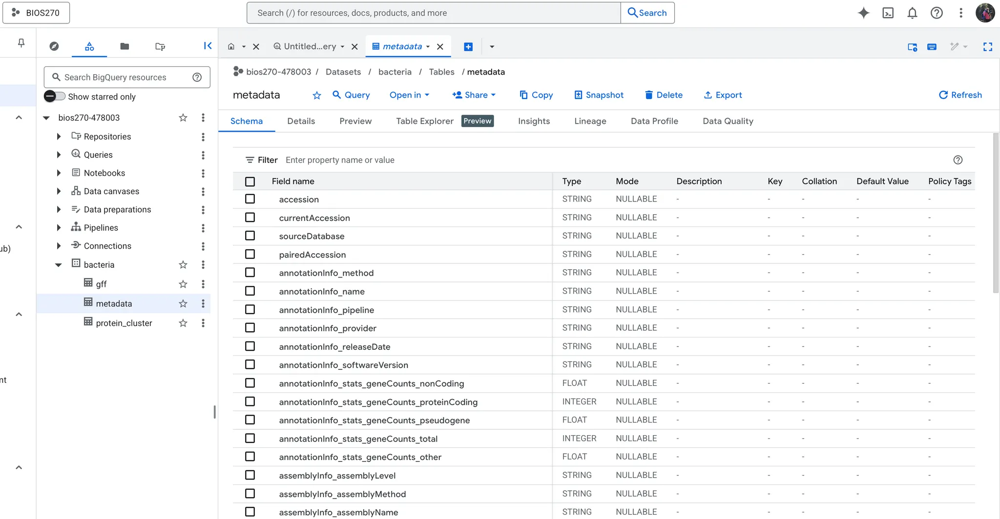

# Writeup 3: Data Management with GCP, SQL, and HDF5

## Setup

### Step 1: SSH Port Forwarding
```bash
ssh -L 53682:localhost:53682 -L 25000:localhost:25000 isagolda@login.farmshare.stanford.edu
```

- `L 53682:localhost:53682` - forwards port for rclone authentication
- `L 25000:localhost:25000` - forwards port for JupyterLab/code-server

### Step 2: Configure .bashrc

```bash
nano ~/.bashrc
source ~/.bashrc
```

### Step 3: Google Cloud Authentication

Setting up access to Google Cloud services from Farmshare allows us to:
- Store data in Google Cloud Storage (like Google Drive but for big data)
- Use BigQuery (a database for analyzing large datasets)
- Access these from code running on Farmshare
```bash
cd $SCRATCH/containers
module load apptainer
apptainer shell bioinformatics_latest.sif

gcloud auth login
gcloud config set project bios270-478003
gcloud auth application-default login
gcloud auth application-default set-quota-project bios270-478003
```

### Step 4: Create Google Cloud Storage Bucket

Created bucket at: https://console.cloud.google.com/storage

Bucket name: `bacteria-isagolda`

### Step 5: Set up rclone for Google Cloud Storage

Configuring `rclone` to connect to Google Cloud Storage bucket allows us to:
- Copy files between Farmshare and Google Cloud Storage
- Move large datasets without downloading to laptop
- Backup data to the cloud
- Access data from anywhere

Used service account method with JSON key for authentication.

### Step 6: Google Drive Configuration

Set up Google Drive remote using rclone on local machine, then copied config to Farmshare.

### Step 7: Create BigQuery Dataset

Created dataset named `bacteria` at: https://console.cloud.google.com/bigquery?project=bios270-478003

---

## Exercise

### Task 1: Create a Local SQL Database

**Steps:**
1. Navigate to the data directory
2. Examine the scripts
3. Submit a SLURM job to create `bacteria.db`
4. Answer questions while it runs
5. Upload the database to GCS and Google Drive

**Submission:**
```bash
cd ~/repos/BIOS270-AU25/Data
sbatch create_bacteria_db.sh
```

Submitted batch job: 1054663

**Monitoring:**
```bash
squeue -u isagolda
cat logs/createdb_1054663_0.err
tail -f logs/createdb_1054663_0.out
```

**Question 1: How many tables will be created?**

**Answer:** 3 tables will be created:
1. `gff` - Gene annotations from all bacterial assemblies
2. `protein_cluster` - Protein clustering results  
3. `metadata` - Assembly metadata

**Question 2: Explain the logic of using `try` and `except`. Why is this necessary?**

**Answer:** The try/except block handles database locking issues that occur when multiple processes try to write to SQLite simultaneously. SQLite only allows one write operation at a time, so when the 5 parallel SLURM array tasks try to insert data concurrently, some will encounter "database is locked" errors. The code retries up to 20 times, waiting 1 second between attempts, allowing the lock to be released by another process. If a different error occurs (not a lock), it raises the exception immediately.

**Upload to Google Cloud Storage and Google Drive:**
```bash
cd /home/users/isagolda/repos/BIOS270-AU25/Data
rclone copy bacteria.db gcs:bacteria-isagolda/
rclone copy bacteria.db gdrive:Courses/BIOS270/bacteria_data/
```

---

### Task 2: Query the Created Database

**Understanding the gff2df function:**

The `gff2df` function reads a GFF file (Gene Feature Format - contains gene annotations) and converts it to a pandas DataFrame.

**Completed TODO sections in query_bacteria_db.py:**
```python
def get_all_record_ids(self):
    query = "SELECT DISTINCT record_id FROM gff"
    df = self.query(query)
    return df["record_id"].dropna().tolist()

def get_protein_ids_from_record_id(self, record_id):
    query = f"SELECT protein_id FROM gff WHERE record_id = '{record_id}' AND protein_id IS NOT NULL"
    df = self.query(query)
    return df["protein_id"].dropna().tolist()
```

**Runtime without index:**
```
Total number of record ids: 4100
Processed 0 record ids in 6.826862096786499 seconds
Processed 10 record ids in 37.28315734863281 seconds
Processed 20 record ids in 69.1079728603363 seconds
Processed 30 record ids in 96.71446418762207 seconds
Processed 40 record ids in 124.60039520263672 seconds
Processed 50 record ids in 152.1250035762787 seconds
Processed 60 record ids in 179.4311397075653 seconds
Processed 70 record ids in 207.6149718761444 seconds
Processed 80 record ids in 235.3950333595276 seconds
Processed 90 record ids in 262.88336515426636 seconds
```

**Runtime with index:**
```
Processed 4090 record ids in 19.656768798828125 seconds
```

**Why does indexing improve performance?**

Without the index on `record_id`, for each query SQLite has to scan through the gff table row by row. With the index, SQLite creates an index on `gff(record_id)` so `record_id_index` can jump straight to rows where the `record_id` matches, instead of scanning the entire table.

---

### Task 3: Upload to Google BigQuery

**Question: Explain the role of CHUNK_SIZE and why it is necessary**

**Answer:** `CHUNK_SIZE` determines the maximum number of rows we will pull from SQLite at once. The query `LIMIT {CHUNK_SIZE} OFFSET {offset}` means "Give me a page of rows, starting at `offset`, up to `CHUNK_SIZE` rows". It is basically reading the tables in pages of up to 500,000 rows.

This is necessary for:
1. **Memory efficiency** - Loading millions of rows at once would exceed available RAM. Chunks keep memory usage constant and manageable.
2. **Network reliability** - Smaller uploads are less likely to fail or timeout. If a chunk fails, only that chunk needs to be retried.
3. **Progress monitoring** - Breaking uploads into chunks allows real-time progress tracking.

**Running the upload script:**
```bash
python upload_bigquery.py \
  --local_database_path bacteria.db \
  --project_id bios270-478003 \
  --dataset_id bacteria
```



**BigQuery Query:**

Created a query on BigQuery (https://console.cloud.google.com/bigquery?project=bios270-478003) that joins multiple tables to find clustered proteins with gene information.

---

### Task 4: HDF5 Data

**Question: Explain why the chunk configuration makes sense**

Chunk configuration:
```python
chunk_size = 1000
chunks = (chunk_size, n_features)
```

---

### Task 5: Practice – Combining SQL and HDF5

**Getting sample record IDs:**
```bash
$RUN python3 << EOF
from query_bacteria_db import BacteriaDatabase

db_path = '/farmshare/home/classes/bios/270/data/processed_bacteria_data/bacteria.db'
db = BacteriaDatabase(db_path)

record_ids = db.get_all_record_ids()[:5]
print("Sample record IDs:")
for rid in record_ids:
    print(f"  {rid}")

db.close()
EOF
```

**Output:**
```
Sample record IDs:
  AP019416.1
  AP019514.1
  AP019515.1
  AP019517.2
  AP023349.1
```

**Note:** Unable to complete the final script to extract protein embeddings due to issues finding record IDs with associated protein data in the processed database.