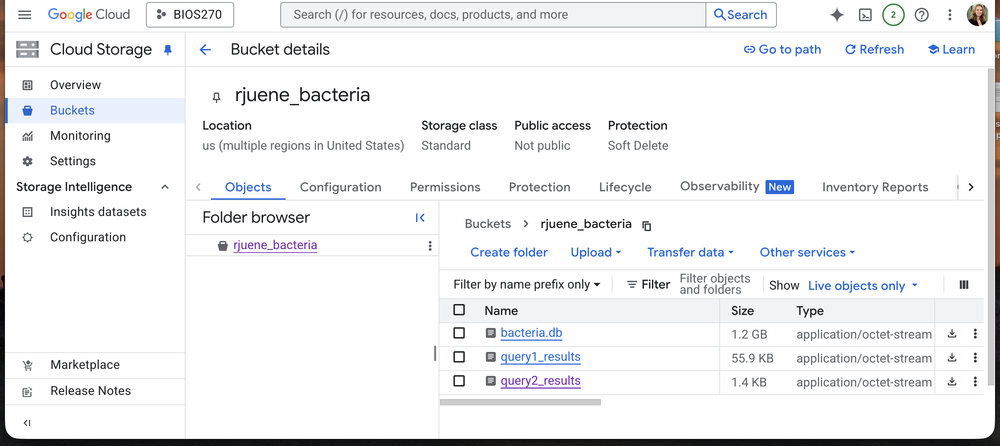

# Write-up 3:

**Name:** Riley Juenemann       
**Student ID:** rjuene    
**Date:** 11/18/2025    

---

## 1. Create a Local SQL Database

Three tables will be created in the database (gff, protein cluser, and metadata).

The try-except clause is needed because the SLURM script creates multiple tasks that are all accessing the same file. So if one is writing to that file then
it might be locked temporarily. This is why it retries a little bit later rather than crashing.

## 2. Query the Created Database

Runtime:
```
Apptainer> python /data/query_bacteria_db.py --database_path /data/bacteria.db
Total number of record ids:  4100
Processed 0 record ids in 7.51871657371521 seconds
Processed 10 record ids in 40.06650352478027 seconds
Processed 20 record ids in 72.11212301254272 seconds
Processed 30 record ids in 105.32299661636353 seconds
Processed 40 record ids in 138.57404041290283 seconds
<STOPPED>
```

Runtime after uncommenting `db.index_record_ids()`: 
```
Apptainer> python /data/query_bacteria_db.py --database_path /data/bacteria.db
Total number of record ids:  4100
Processed 0 record ids in 0.5312299728393555 seconds
Processed 10 record ids in 0.5551722049713135 seconds
Processed 20 record ids in 0.5642111301422119 seconds
Processed 30 record ids in 0.5938324928283691 seconds
Processed 40 record ids in 0.6137032508850098 seconds
Processed 50 record ids in 0.6277873516082764 seconds
Processed 60 record ids in 0.6607205867767334 seconds
Processed 70 record ids in 0.6861264705657959 seconds
Processed 80 record ids in 0.7075376510620117 seconds
Processed 90 record ids in 0.7342360019683838 seconds
Processed 100 record ids in 0.7574162483215332 seconds
Processed 110 record ids in 0.7718081474304199 seconds
Processed 120 record ids in 0.7993264198303223 seconds
Processed 4080 record ids in 8.68770694732666 seconds
Processed 4090 record ids in 8.697349548339844 seconds
Total time: 8.711448907852173
Total number of protein ids:  8143120

```

The run time is much faster after uncommenting `db.index_record_ids()` because
without indexing all queries have to search through every row of the table. Indexing
builds a structural sorted representation of the data to allow for faster queries.


## 3. Upload to Google BigQuery

Chunking can lead to more efficient operations. For instance, if you chunk your
data then for queries you only have to load that chunk into memory, rather
than the entire database. In the context of uploading to Google BigQuery in this
script, CHUNK_SIZE is playing the role of ensuring both quicker reads from the SQL
table, and also ensuring that available RAM is not exceeded when loading data in
to write to BigQuery. It is necessary because this ensures robustness of the writing
process. Trying to load and write all of the data at once might lead to failures.

Queries:
`SELECT DISTINCT record_id FROM gff;`
`SELECT protein_id FROM bacteria.gff WHERE record_id = 'NZ_CP073375.1';`



## 4. HDF5 Data

Explain why the following chunk configuration makes sense - what kind of data access pattern is expected, and why does this align with biological use cases?

This chunk configuration is accessing all feature columns for 1000 rows at a time.
This makes sense because the data access pattern expected is creating embeddings
for each protein sample, and we need all features for that protein in order to
make the embedding. This aligns with biological use cases because we usually collect
a limited number of data for a lot of samples, in this case proteins. So our rows
are usually uniquely identified as rows. (Though in some time series scenarios
time can be rows and the data for each time point for each sample are the columns).

## 5. Practice – Combining SQL and HDF5

Skipped since I have already spent multiple hours on this writeup, including
helping debug file permissions issues for the class folder for step 2.


